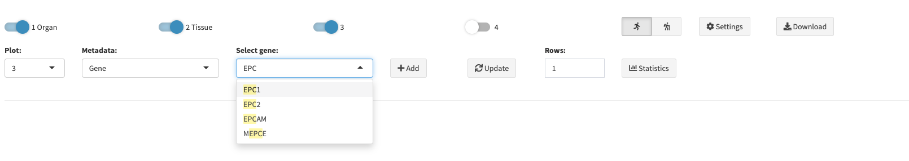
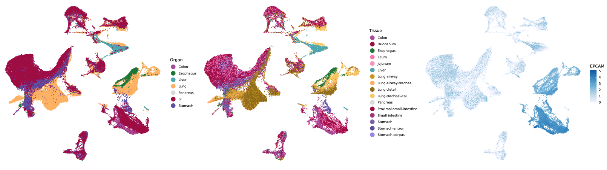
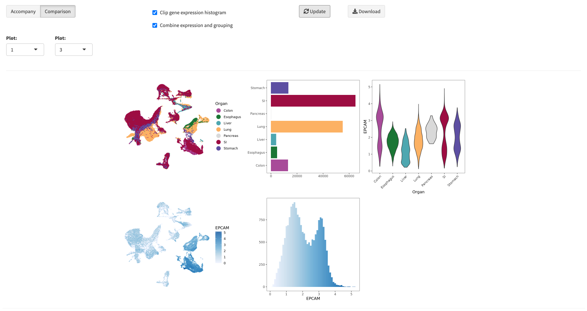
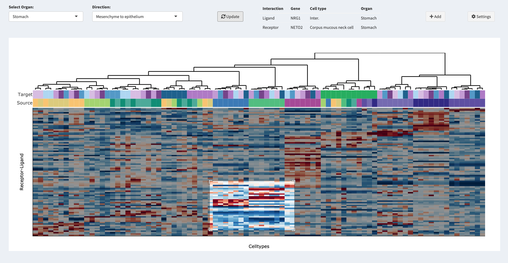
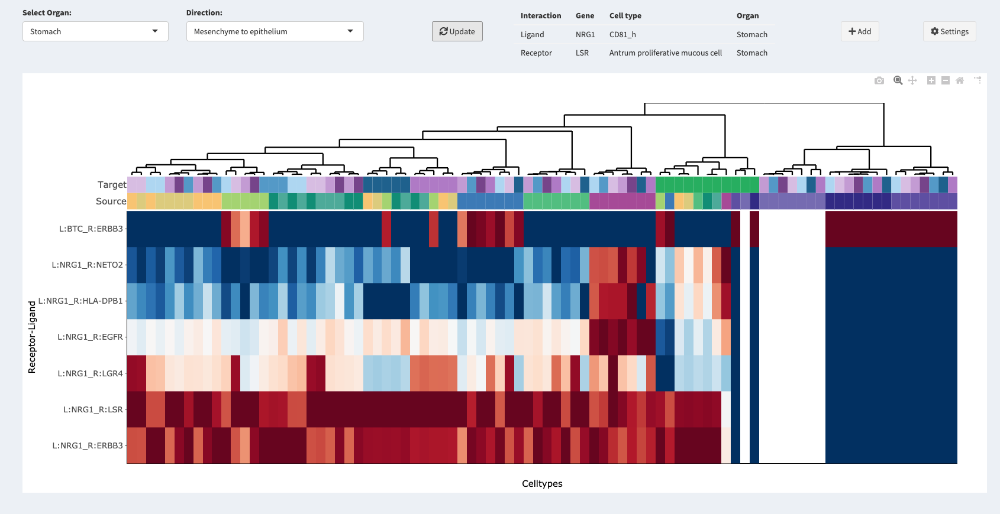
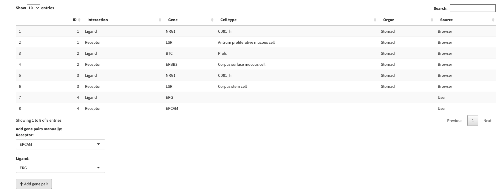
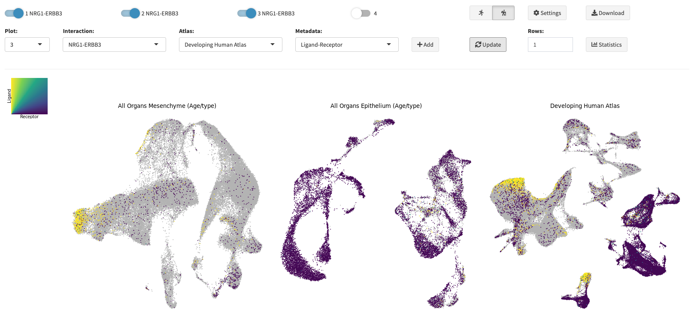
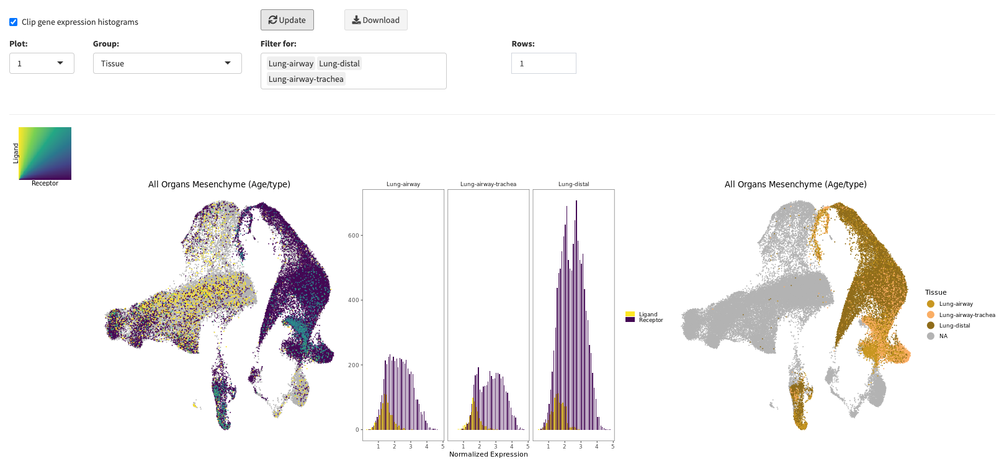

# GutTubeR

This Shiny data browser accompanies the paper "Charting human development using a multi-endodermal organ cell atlas and organoid technologies". In general, GutTubeR consists of two main sections: The Atlas section allows you to browse selected single cell RNA sequencing datasets from the paper by creating multiple UMAPs with various meta annotations and customizable settings as well as gaining deeper insights into the data by observing and comparing distributions of gene expression and annotations. Within the Interactions section you can browse signalling interactions between mesenchyme and epithelial across all organs available from our datasets in an interactive fashion. Ongoing from your selection you can inspect interesting ligand-receptor pairs further on bivariate colored UMAPs accompanied by their respective distributions. Please visit <http://guttuber.iob.ch/app> in order to check out GutTubeR by yourself. There you will also find a more detailed instructions on how to use GutTubeR.  

## Atlas 
Within the Atlas section you can create UMAPs of selected datasets in a dynamic fashion. Select how many plots you want to create by activating up to four plots with the switches at the top and choose the meta annotations for the corresponding UMAPs. Note, if you want to annotate gene expression, just type and search for your gene of interest in the selection field. You can also filter grouping annotations by selecting multiple groups from the filter selection menu. Note, that when clicking the Add button the corresponding plot will be created with the current settings and it will overwrite existing annotations for that plot. Adjusting settings later on will just affect newly added plots. This allows you to select for example different color scales for gene expression on the same UMAP or load and compare other datasets to already created UMAPs from different datasets. 

### Statistics 
The statistics window allows you to plot underlying distributions of your created UMAPS. You can either accompany a selected UMAP with a distribution for its selected annotation or compare two UMAPs and their corresponding distributions. Note, that when you select a UMAPs with a discrete mapping and a gene expression mapping, a combined violine plot will be created showing the gene expression grouped by the selected discrete meta annotation. 

## Interactions

### Browser

This sections allows you to browse the results of CellPhoneDB analysis for signalling between mesenchyme and epithelial across all organs available from our datasets with an interactive interaction heatmap. You can hover over individual tiles of the heatmap in order to highlight specific ligand-receptor pairs and their related pathway/celltype/organ information. When you found a interesting pair you can save this interaction and investigate it further in the Inspector section. Note that you can navigate to specific areas of the heatmap by drawing a rectangular into the selected area. And that it is also possible to filter the interaction pairs for genes of your interest as well as setting the center of the colorscaling to either rowwise or columnwise. 

### Editor
The Editor allows you to view and edit all selected interactions from the Browser section as well as add receptor-ligand pairs manually to your selection. 

### Inspector 
The Inspect section enables you to map ligand-receptor pairs by bivariate color mapping to UMAPs of either all organs or specific ones. The plotting interface has the same functionalities as already described for the Atlas section. Meaning that you can plot up to four different UMAP embeddings of different datasets with annotations for gene expression for either ligand or receptor, age, organ, tissue and cell type. In addition it is possible to select annotations for ligand-receptor expression which utilizes bivariate coloring and mapping.

### Statistics 
In the Statistics section of the Inspector you can accompany the UMAP of selected ligand-receptor interactions or other selected annotations with their corresponding distributions grouped by either organ, tissue or cell type that can also be filtered. When a grouping is selected, the corresponding annotated UMAP is plotted additionally. The filtering also applies to the added UMAP with the grouping annotation allowing for better orientation. 

## About

