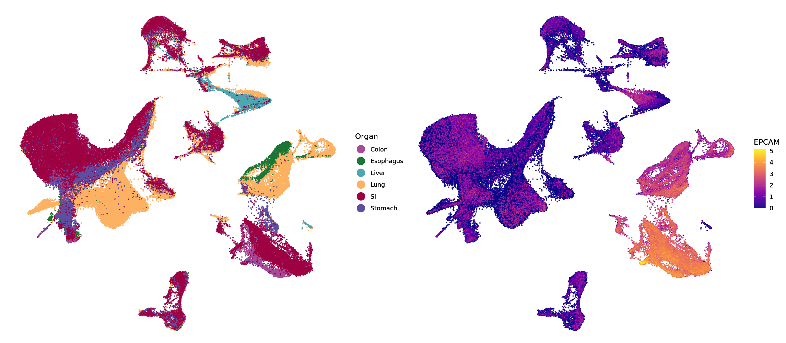

# GutTubeR

This Shiny data browser accompanies the paper "Charting human development using a multi-endodermal organ cell atlas and organoid technologies". In general, GutTubeR consists of two main sections: The Atlas section allows you to browse selected single cell RNA sequencing datasets from the paper by creating multiple UMAPs with various meta annotations and customizable settings as well as gaining deeper insights into the data by observing and comparing distributions of gene expression and annotations. Within the Interactions section you can browse signalling interactions between mesenchyme and epithelial across all organs available from our datasets in an interactive fashion. Ongoing from your selection you can inspect interesting ligand-receptor pairs further on bivariate colored UMAPs accompanied by their respective distributions. 

